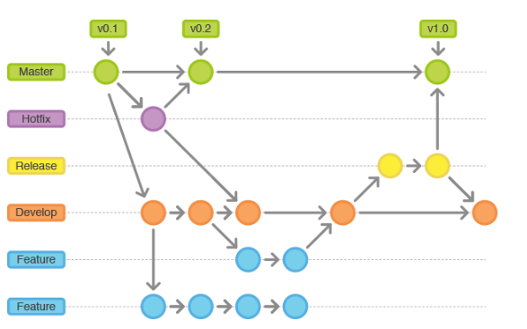

# Metodologia

Pré-requisitos: <a href="2-Especificação do Projeto.md"> Documentação de Especificação</a>

A metodologia contempla as definições de ferramental utilizado pela equipe tanto para a manutenção dos códigos e demais artefatos quanto para a organização do time na execução das tarefas do projeto.

## Relação de Ambientes de Trabalho
Os artefatos do projeto são desenvolvidos a partir de diversas plataformas e a relação dos ambientes com seu respectivo propósito é apresentada na tabela que se segue. 

|Ambiente           | Plataforma | Link de Acesso |
|------------------|------------|----------------|
|Repositório de código fonte| GitHub |https://github.com/ICEI-PUC-Minas-PMV-ADS/pmv-ads-2024-1-e2-proj-int-t3-grupo01 |
|Documentos do projeto| Google Drive |https://docs.google.com/document/d/1lbAMOrUWa3ZGu5U9wK3zqG4raUNoXeMI/edit |
|Projeto de Interface e  Wireframes|  |--|
|Gerenciamento do Projeto| Jira |https://grupo1exio2pucminas.atlassian.net/jira/software/projects/KAN/boards/1/backlog |

## Gestão de código fonte

Para gestão do código fonte do software desenvolvido pela equipe, o grupo utiliza um processo baseado no Git Flow abordado por Vietro (2015), mostrado na Figura a seguir. Desta forma, todas as manutenções no código são realizadas em branches separados, identificados como Hotfix, Release, Develop e Feature. Uma explicação rápida sobre este processo é apresentada no vídeo "The gitflow workflow - in less than 5 mins".

Figura 2 - Fluxo de controle do código fonte no repositório git

## Gerenciamento do projeto

A equipe utiliza metodologias ágeis, tendo escolhido o Scrum como base para definição do processo de desenvolvimento.

> A equipe está organizada da seguinte maneira:
> - Scrum Master: 
>   - João Victor Antunes
> - Product Owner:
>   - Erika Negreiros
> - Equipe de Desenvolvimento
>   - Naiana Mendonça
>   - Diana
>   - Diego Rafael
>   - João Gabriel

> Para organização e distribuição das tarefas do projeto, a equipe está utilizando o Jira, conforme as seguintes definições:
Features: representa as entregas que devem ser realizadas
Histórias: representa os itens ou tópicos que devem ser atendidos a cada entrega
> - **Tarefas**: representa as atividades ou sub-tópicos que serão realizados.
> - **Não Iniciado**: recebe as histórias a serem trabalhadas e representa o Product Backlog. Todas as atividades identificadas no decorrer do projeto também devem ser incorporadas a esta lista.
> - **Planejado**: recebe as histórias que já estão descritas e prontas para serem iniciadas
> - **Doing**: recebe as histórias que já tiveram seu desenvolvimento iniciado
> - **Check**: receber as histórias finalizadas e que estão sendo validadas/testadas
> - **Done**: recebe as histórias finalizadas e testas que já foram entregues
